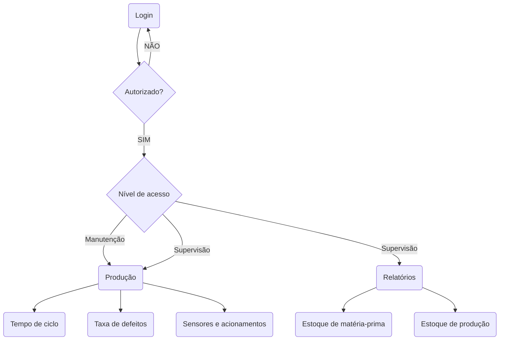
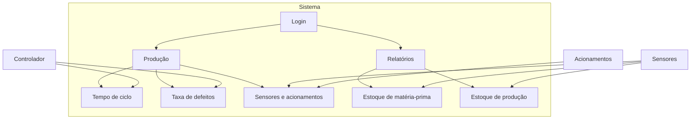
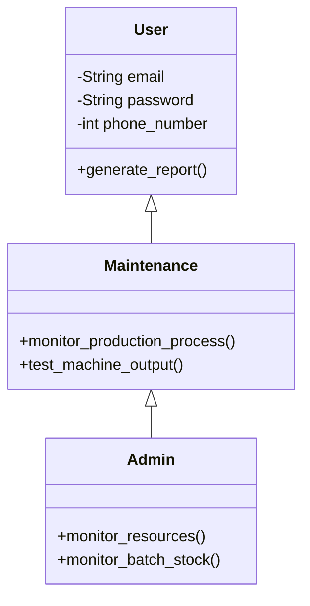

# PRD - Product Requirements Document

# *Introdução & objetivo*

Devido à ineficiência do sistema manual de coleta de dados na indústria e à ausência de relatórios e visualizações estratégicas em tempo real do processo de manufatura, é essencial desenvolver um sistema automatizado de coleta e análise de dados de produção para um web site da empresa. Esse sistema será integrado a sensores instalados na linha de produção por meio de protocolos MQTT, permitindo o envio de alertas e mensagens para o supervisor de produção em caso de erros, e notificações diretamente ao fornecedor e distribuidor em situações relacionadas ao estoque.

# *Por que* implementar isto?

*"Atualmente, a fábrica utiliza um sistema manual para coletar esses dados, o que é ineficiente, sujeito a erros e dificulta a análise da performance da produção"*

Como retirado no próprio escopo do projeto, a manipulação manual dos dados e recursos da linha de produção é insuficiente para suprir precisamente as necessidades da indústria. Assim, a mensageria possibilitada pela automatização da coleta e análise dos dados, torna a visualização da produção manufatureira mais clara e precisa, além de proporcionar a tomada de decisão automática, quando, por exemplo, houver falta de matéria-prima.

A pergunta hoje não é **se** você irá aderir a automatização, **mas quando**.

# ***Público alvo***

À vista do meio fabril a ser implementado, bem como a noção necessária para a interpretação da visualização dos dados da empresa, faz-se preciso somente a liberação de acesso para os funcionários administradores e manunteros da produção de peças de automóveis. Portanto, essa medida visa garantir que informações sensíveis e estratégicas da empresa, como dados de desempenho, métricas de eficiência e controle de qualidade, sejam manuseadas por pessoal qualificado e autorizado.

Os relatórios de desempenho podem, por exemplo, verificar se uma máquina está danificada que, consequentemente, prejudica todo o processo. Nesse contexto, a equipe de manutenção deve possuir acesso ao sistema, havendo contato somente a essas informações, ou seja, de privilégio diferente da equipe administrativa.

| **Perfil de usuário** | **Descrição, necessidades e interesses.** |
| --- | --- |
| Supervisor administrativo | Responsável por policiar a execução plena da linha de produção, deverá, através do sistema, verificar o ciclo individual da peça em sua fabricação, por meio de gráficos e relatórios automatizados. |
| Equipe de manutenção | Acesso de privilégio limitado apenas aos dados referentes ao estado das máquinas, a fim de ratificar a ocorrência de defeitos na linha de produção. |

# *Personas*

1. **Marcos Souza:** Supervisor Administrador de Produção a cargo de otimizar os processos de produção para aumentar a eficiência e reduzir custos operacionais por meio das análises de dados de todo sistema.
2. **Luana Pereira:** Operadora de Produção que deve realizar seu trabalho com excelência, garantindo que as peças produzidas atendam aos padrões de qualidade da empresa, sem interferir na linha de produção e possuir acesso ao sistema.
3. **Manoel Gomes:**  Técnico de Manutenção que minimiza o tempo de inatividade das máquinas por meio de manutenção preventiva eficaz, recebendo somente acesso aos avisos de manutenção do sistema.

---

# *Requisitos Funcionais*

1. **Relatório:** Toda análise realizada por um usuario após a visualização ou interferencia no sistema. **P2**
2. **Login:** Tela inicial do sistema, na qual o usuário deverá fornecer seus dados previamente cadastrados para acessar a aplicação. É nesta etapa que será definida o nível de acesso para o sistema. **P1**
3. **Gráficos:** Forma visual e gráfica para uma melhor apresentação dos gráficos coletados da linha de produção. **P1**
4. **Recebimento e processamento dos dados:** Transformação dos dados recebidos pelos sensores em insights para a análise descritiva. **P1**
3. **Acionamentos:** Controle das saídas físicas dos equipamentos que integram na produção. **P3**

**P1** = **Crítico | P2 = Importante | P3 = Bom ter**

### *Casos de uso e/ou User story*

> **Caso de uso 1:** Como um manutentor da indústria, eu quero gerar relatórios sobre os detalhes da manutenção realizada, bem como os acionamentos feitos.
> 

> **Caso de uso 2:** Como um usuário, eu quero ter acesso específico ao sistema, para que, quando gerar um relatório, seja identificado.
> 

> **Caso de uso 3:** Como um supervisor da administração, quero monitorar o processo de produção e estoque pela visualização dos dados, para previnir possíveis problemas.
> 

> **Caso de uso 4:** Como um manutentor, eu quero acionar as saídas digitais e analógicas, para testar a plenitude dos equipamentos, em caso dos dados serem infavoráveis.
> 

---

# *Requisitos Não Funcionais*

1. **Hierarquia do nível de acesso:** Separa as funcionalidades e privilégios da visualização e interferência dos dados por acessos referentes ao cargo do funcionário. **P2**
2. **Acuracia dos dados :** Garantir que os dados estejam corretos e precisos para a posterior análise e modelagem. **P1**
3. **Mensageria de estoque:** Solicitar suprimentos e entregas dos lotes de forma automatizada. **P2**
4. **Sensores:** Assegurar que os dispositivos de entrada dos dados estejam em bom funcionamento para, consequentemente, gerar insights nas análises. **P1**
5. **Acessibilidade do sistema:** Apesar da necessidade da usuabilidade nas mais diversas condições físicas e psicológicas, devem ser contadas previamente para o desenvolvimento de funcionalidades individuais de cada usuário. **P3**

**P1** = **Crítico | P2 = Importante | P3 = Bom ter**

# Diagrama de atividade

# Diagrama de Contexto

# Diagrama UML

### 📊 Métricas

[Seja específico ao descrever os padrões ou métricas que devem ser atendidos. Inclua descrições detalhadas e, se possível, métricas mensuráveis.]

---

# *Fora de escopo*

<aside>
🚫 Liste todos os itens que estarão fora do escopo deste recurso do produto

</aside>

# *User Experience*

<aside>
🖍️ Crie links para seu arquivos de UX aqui: UX Flows, UI, etc.

</aside>

# *Dependências*

<aside>
⚠️ Quais necessidades que precisam ser supridas para que este produto/feature seja desenvolvido?

</aside>

# *Plano de lançamento*

*Crie uma lista de itens que precisão ser atendidos para o lançamento do produto no mercado, por exemplo:*

1. *Regras para lançamento interno:*
    - [ ]  *Validação*
    - [ ]  *Divulgação*

# 💌 *Plano de comunicação*

Quando as comunicações acontecerão? Quem será notificado sobre esse novo recurso? Enviaremos e-mails e notificações no aplicativo?